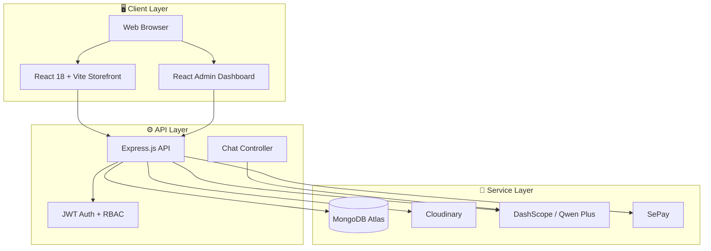
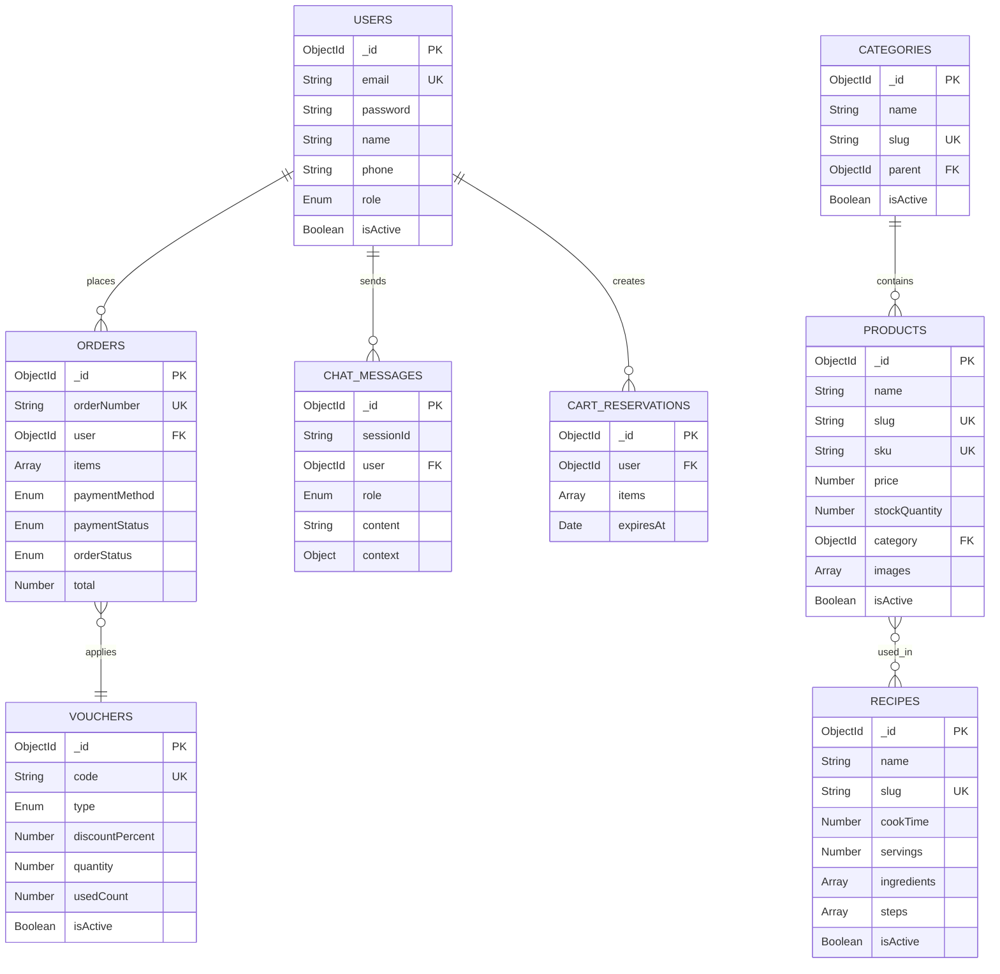

<p align="center">
  
  
  
  
  
</p>

<h1 align="center">
  <br>
  TTDN Ecommerce Market Shop
  <br>
</h1>

<h4 align="center">AI-powered food shopping platform with recipe intelligence, storefront theming and admin operations.</h4>

<p align="center">
  <a href="#-introduction">Introduction</a> •
  <a href="#-features">Features</a> •
  <a href="#-architecture">Architecture</a> •
  <a href="#-quick-start">Quick Start</a> •
  <a href="#-environment-configuration">Environment</a> •
  <a href="#-project-structure">Project Structure</a> •
  <a href="#-available-scripts">Scripts</a>
</p>

---

## 📖 Introduction

**TTDN Ecommerce Market Shop** là nền tảng thương mại điện tử chuyên cho thực phẩm, nguyên liệu nấu ăn và công thức món ăn. Dự án hiện kết hợp storefront theo theme hiện đại, backend quản lý bán hàng và trợ lý AI tư vấn mua sắm bằng **Qwen / DashScope**.

| USP | Mô tả |
|-----|-------|
| 🛒 **Storefront theo theme shop** | Giao diện mua sắm, công thức và tài khoản được chuyển đổi từ template HTML/CSS sang React |
| 🍳 **Recipe-driven shopping** | Xem công thức, nguyên liệu liên quan và thêm nhanh sản phẩm vào giỏ hàng |
| 🤖 **Smart Shopping Assistant** | Chat AI dựa trên ngữ cảnh sản phẩm, công thức và giỏ hàng hiện tại |
| 💳 **Realtime checkout flow** | Hỗ trợ COD và chuyển khoản/SePay với quy trình đặt hàng rõ ràng |

### Tại sao chọn dự án này?

- **Trải nghiệm mua sắm liền mạch**: Từ trang chủ, mua sắm, công thức, giỏ hàng đến thanh toán đều dùng chung một hệ giao diện.
- **Quản trị tập trung**: Admin có thể quản lý sản phẩm, đơn hàng, người dùng, công thức và voucher trong cùng dashboard.
- **AI bám sát ngữ cảnh hệ thống**: Chatbot không trả lời chung chung mà dựa trên sản phẩm và công thức hiện có trong database.
- **Tối ưu cho demo và phát triển tiếp**: Monorepo rõ ràng, backend Express tách controller/route/model, frontend tổ chức theo feature.

---

## ✨ Features

### 🛍️ Customer Features

```
┌─────────────────────────┬─────────────────────────┬─────────────────────────┐
│  STOREFRONT             │  RECIPE HUB             │  AI ASSISTANT           │
├─────────────────────────┼─────────────────────────┼─────────────────────────┤
│  • Trang chủ theo theme │  • Danh sách công thức  │  • Chat thông minh      │
│  • Catalog sản phẩm     │  • Chi tiết công thức   │  • Có ngữ cảnh giỏ hàng │
│  • Tìm kiếm & lọc       │  • Nguyên liệu liên kết │  • Gợi ý món ăn/mua sắm │
│  • Giỏ hàng & checkout  │  • Thêm vào giỏ hàng    │  • Trả lời bằng tiếng Việt │
│  • Đơn hàng & hồ sơ     │  • Ảnh công thức        │  • Dùng Qwen Plus       │
└─────────────────────────┴─────────────────────────┴─────────────────────────┘
```

### 🔐 Authentication & Security

- JWT-based authentication cho customer và admin
- Role-based access control: `customer`, `admin`, `superadmin`
- Password hashing với `bcryptjs`
- `helmet`, `cors`, `express-rate-limit` cho các lớp bảo vệ cơ bản

### 💰 Payment Integration

- **COD (Cash on Delivery)** cho luồng đặt hàng thông thường
- **Bank transfer / SePay** cho xác nhận thanh toán và IPN
- Lưu lịch sử đơn hàng, trạng thái thanh toán và trạng thái giao hàng

### 📊 Admin Dashboard

- Dashboard tổng quan doanh thu, đơn hàng và sản phẩm
- Quản lý sản phẩm, hình ảnh và tồn kho
- Quản lý đơn hàng và chi tiết đơn hàng
- Quản lý người dùng
- Quản lý công thức nấu ăn
- Quản lý voucher giảm giá và voucher freeship mặc định

### 🎨 UI / UX Improvements

- Header hỗ trợ **ngôn ngữ `VI/EN`** và tự đồng bộ tiền tệ `VND/USD`
- **Dark mode / light mode** với toggle trên storefront
- Theme storefront và admin được port từ template sang React
- Ảnh sản phẩm, ảnh công thức và danh mục được tối ưu hiển thị theo layout mới

---

## 🏗️ Architecture

### System Overview



### Tech Stack

| Layer | Technology | Purpose |
|-------|------------|---------|
| **Frontend** | React 18, TypeScript, Vite | UI framework và bundler |
| | React Router v6 | Routing |
| | Zustand, TanStack Query | State management và data fetching |
| | Framer Motion, template CSS assets | Animation và giao diện storefront/admin |
| **Backend** | Node.js, Express | API server |
| | MongoDB, Mongoose | Database |
| | JWT, bcryptjs | Authentication |
| | Multer, Cloudinary | Upload và quản lý media |
| **AI** | DashScope compatible mode | OpenAI-compatible endpoint |
| | Qwen Plus | Chat model cho trợ lý mua sắm |
| **Infrastructure** | SePay | Payment / IPN |
| | Cloudinary | Media CDN |

---

## 📊 Database Design

### Entity Relationship Diagram



---

## 🎯 Use Case Diagram

```mermaid
flowchart TB
    subgraph Actors
        Customer((Customer))
        Admin((Admin))
        AI((AI System))
        Payment((SePay))
    end

    subgraph "Authentication"
        UC1[Register Account]
        UC2[Login / Logout]
        UC3[Manage Profile]
    end

    subgraph "Shopping"
        UC4[Browse Products]
        UC5[Search and Filter]
        UC6[Add to Cart]
        UC7[Checkout]
        UC8[Track Orders]
    end

    subgraph "Recipes"
        UC9[Browse Recipes]
        UC10[View Recipe Detail]
        UC11[Add Ingredients to Cart]
    end

    subgraph "AI Assistant"
        UC12[Chat with AI]
        UC13[Get Product Recommendations]
        UC14[Get Meal Suggestions]
    end

    subgraph "Administration"
        UC15[Manage Products]
        UC16[Manage Orders]
        UC17[Manage Users]
        UC18[Manage Recipes]
        UC19[Manage Vouchers]
        UC20[View Dashboard]
    end

    Customer --> UC1
    Customer --> UC2
    Customer --> UC3
    Customer --> UC4
    Customer --> UC5
    Customer --> UC6
    Customer --> UC7
    Customer --> UC8
    Customer --> UC9
    Customer --> UC10
    Customer --> UC11
    Customer --> UC12

    Admin --> UC2
    Admin --> UC15
    Admin --> UC16
    Admin --> UC17
    Admin --> UC18
    Admin --> UC19
    Admin --> UC20

    UC12 --> AI
    AI --> UC13
    AI --> UC14
    UC7 --> Payment
```



---

## 🚀 Quick Start

### Prerequisites

Đảm bảo bạn đã cài đặt:

- **Node.js** >= 18
- **npm** >= 9
- **MongoDB Atlas** hoặc MongoDB server tương thích
- **Git**

### Installation

```bash
# 1. Clone repository
git clone https://github.com/your-username/TTDN_Ecommerce_Market_Shop.git
cd TTDN_Ecommerce_Market_Shop

# 2. Install dependencies
npm install

# 3. Tạo file env cho client
cp client/.env.example client/.env

# 4. Tạo server/.env thủ công theo mẫu ở phần Environment Configuration

# 5. Seed database (optional)
npm run seed --workspace=server

# 6. Start development servers
npm run dev
```

### Verify Installation

Sau khi chạy `npm run dev`, mở browser:

| Service | URL | Status |
|---------|-----|--------|
| Frontend | http://localhost:5173 | React storefront |
| Backend API | http://localhost:5000/api | REST API |
| Health Check | http://localhost:5000/health | `{"status":"ok"}` |

---

## ⚙️ Environment Configuration

### Server Environment (`server/.env`)

```bash
# SERVER
NODE_ENV=development
PORT=5000

# DATABASE
MONGODB_URI=mongodb+srv://<user>:<password>@cluster.mongodb.net/ecommerce_shop

# AUTH
JWT_SECRET=your-super-secret-key-min-32-characters
JWT_EXPIRES_IN=7d

# CLOUDINARY
CLOUDINARY_CLOUD_NAME=your-cloud-name
CLOUDINARY_API_KEY=your-api-key
CLOUDINARY_API_SECRET=your-api-secret

# SEPAY
SEPAY_MERCHANT_ID=your-sepay-merchant-id
SEPAY_SECRET_KEY=your-sepay-secret-key
SEPAY_API_URL=https://sandbox.sepay.vn/v1
SEPAY_IPN_URL=http://localhost:5000/api/orders/sepay-ipn

# AI (Alibaba DashScope / Qwen)
DASHSCOPE_API_KEY=your-dashscope-api-key
DASHSCOPE_BASE_URL=https://dashscope-intl.aliyuncs.com/compatible-mode/v1
DASHSCOPE_MODEL=qwen-plus

# CORS
CLIENT_URL=http://localhost:5173
```

### Client Environment (`client/.env`)

```bash
VITE_API_URL=http://localhost:5000/api
VITE_CLOUDINARY_CLOUD_NAME=your-cloud-name
```

---

## 📁 Project Structure

```text
TTDN_Ecommerce_Market_Shop/
├── client/                         # Frontend application
│   ├── public/                     # Static assets và imported theme assets
│   ├── src/
│   │   ├── assets/                 # Global styles, theme CSS
│   │   ├── components/             # Shared UI components
│   │   ├── constant/               # Route paths, constants
│   │   ├── features/               # Feature modules
│   │   │   ├── admin/
│   │   │   ├── auth/
│   │   │   ├── cart/
│   │   │   ├── chat/
│   │   │   ├── checkout/
│   │   │   ├── orders/
│   │   │   ├── products/
│   │   │   ├── recipes/
│   │   │   ├── shared/
│   │   │   └── storefront/
│   │   ├── hooks/                  # Custom hooks
│   │   ├── layouts/                # StorefrontLayout, AdminLayout
│   │   ├── pages/                  # Route-level pages
│   │   ├── routes/                 # App routes và guards
│   │   ├── store/                  # Zustand stores
│   │   ├── App.css
│   │   ├── App.tsx
│   │   ├── index.css
│   │   ├── main.tsx
│   │   └── vite-env.d.ts
│   ├── index.html
│   ├── package.json
│   ├── tailwind.config.ts
│   ├── tsconfig.json
│   └── vite.config.ts
├── server/                         # Backend application
│   ├── src/
│   │   ├── config/
│   │   ├── controllers/
│   │   ├── data/
│   │   ├── middlewares/
│   │   ├── models/
│   │   │   ├── User.model.ts
│   │   │   ├── Product.model.ts
│   │   │   ├── Category.model.ts
│   │   │   ├── Recipe.model.ts
│   │   │   ├── Order.model.ts
│   │   │   ├── Voucher.model.ts
│   │   │   ├── ChatMessage.model.ts
│   │   │   └── CartReservation.model.ts
│   │   ├── routes/
│   │   ├── scripts/
│   │   ├── utils/
│   │   └── index.ts
│   ├── .env
│   ├── package.json
│   └── tsconfig.json
├── shared/                         # Shared package
│   ├── types/
│   └── package.json
├── docs/                           # Project documentation
│   ├── pagination-architecture.md
│   ├── pagination-flow.md
│   └── PLAN-phase1-foundation.md
├── package.json                    # Monorepo root
├── package-lock.json
└── README.md
```

---

## 🔧 Available Scripts

### Root Level

| Command | Description |
|---------|-------------|
| `npm run dev` | Start cả frontend và backend |
| `npm run dev:client` | Start frontend only |
| `npm run dev:server` | Start backend only |
| `npm run build` | Build cả client và server |
| `npm run build:client` | Build client |
| `npm run build:server` | Build server |
| `npm run clean` | Xóa thư mục build |

### Server Scripts

```bash
cd server

npm run dev                    # Start với hot-reload
npm run build                  # Compile TypeScript
npm run start                  # Run production build
npm run seed                   # Seed database
npm run sync:product-images    # Đồng bộ ảnh sản phẩm từ Cloudinary
npm run sync:recipe-images     # Đồng bộ ảnh công thức từ Cloudinary
```

### Client Scripts

```bash
cd client

npm run dev          # Start Vite dev server
npm run build        # Build for production
npm run preview      # Preview production build
npm run lint         # Frontend lint script
```

---

## 🤝 Contributing

Chúng tôi hoan nghênh mọi đóng góp. Quy trình đề xuất:

### Development Workflow

```bash
# 1. Fork repository

# 2. Clone fork của bạn
git clone https://github.com/YOUR_USERNAME/TTDN_Ecommerce_Market_Shop.git

# 3. Tạo branch mới
git checkout -b feature/amazing-feature

# 4. Commit changes
git commit -m "feat(scope): add amazing feature"

# 5. Push branch
git push origin feature/amazing-feature

# 6. Mở Pull Request
```

### Commit Convention

Sử dụng [Conventional Commits](https://www.conventionalcommits.org/):

```text
<type>(<scope>): <description>
```

| Type | Description |
|------|-------------|
| `feat` | New feature |
| `fix` | Bug fix |
| `docs` | Documentation only |
| `style` | Code style / formatting |
| `refactor` | Code refactoring |
| `perf` | Performance improvement |
| `test` | Adding tests |
| `chore` | Maintenance tasks |

**Examples:**

```bash
feat(chat): switch AI assistant to DashScope qwen-plus
fix(storefront): align featured product images
docs(readme): refresh setup and environment guide
refactor(routes): move page mapping into AppRoutes
```

### Code Style

- **TypeScript-first** cho cả frontend và backend
- **Feature-based structure** ở frontend
- **Express controller/route/model split** ở backend
- Ưu tiên giữ tên biến, route và module bám sát domain thực phẩm / thương mại điện tử

---

## 📄 License

Distributed under the **MIT License**. See `LICENSE` for more information.

```text
MIT License

Copyright (c) 2024 TTDN Ecommerce Market Shop

Permission is hereby granted, free of charge, to any person obtaining a copy
of this software and associated documentation files (the "Software"), to deal
in the Software without restriction, including without limitation the rights
to use, copy, modify, merge, publish, distribute, sublicense, and/or sell
copies of the Software.
```

---

## 🙏 Acknowledgements

- [React](https://react.dev/) - UI library
- [Vite](https://vitejs.dev/) - Frontend tooling
- [MongoDB](https://www.mongodb.com/) - Database
- [Cloudinary](https://cloudinary.com/) - Media storage
- [Alibaba Cloud Model Studio / DashScope](https://www.alibabacloud.com/help/en/model-studio/) - Qwen API provider
- [SePay](https://sepay.vn/) - Payment integration
- [Framer Motion](https://www.framer.com/motion/) - Motion and animation
- [Lucide](https://lucide.dev/) - Icon set

---

<p align="center">
  Made for TTDN Ecommerce Market Shop
</p>

<p align="center">
  <a href="#-introduction">Back to Top ↑</a>
</p>
