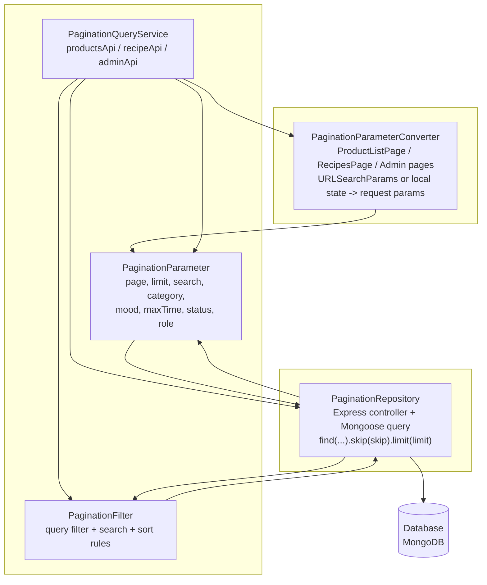

# Pagination Architecture Diagram

This diagram follows the same block-style structure as the reference image and maps directly to the pagination flow used in this project.

## Mapping To Current Project

- `PaginationParameterConverter`
  - `client/src/features/products/ProductListPage.tsx`
  - `client/src/features/recipes/RecipesPage.tsx`
  - `client/src/features/admin/AdminProductsPage.tsx`
  - `client/src/features/admin/AdminOrdersPage.tsx`
  - `client/src/features/admin/AdminUsersPage.tsx`
  - `client/src/features/admin/AdminRecipesPage.tsx`

- `PaginationParameter`
  - `page`
  - `limit`
  - `search`
  - `category`
  - `mood`
  - `maxTime`
  - `status`
  - `role`

- `PaginationQueryService`
  - `client/src/features/products/services/productsApi.ts`
  - `client/src/features/recipes/services/recipeApi.ts`
  - `client/src/features/admin/services/adminApi.ts`

- `PaginationFilter`
  - Built inside:
    - `server/src/controllers/product.controller.ts`
    - `server/src/controllers/recipe.controller.ts`
    - `server/src/controllers/admin.controller.ts`
    - `server/src/controllers/adminRecipe.controller.ts`

- `PaginationRepository`
  - Mongoose queries using:
    - `.find(filter)`
    - `.sort(...)`
    - `.skip((page - 1) * limit)`
    - `.limit(limit)`
    - `.countDocuments(filter)`

- `Database`
  - MongoDB

