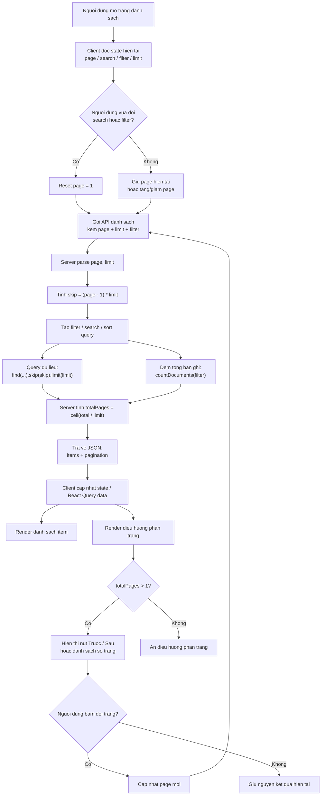
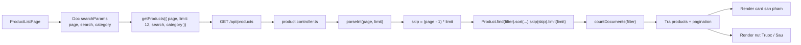
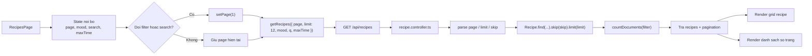
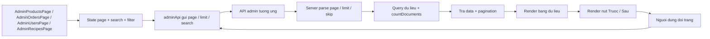

# So do hoat dong phan trang

Tai lieu nay mo ta luong phan trang dang duoc dung trong frontend client va backend server cua du an.

## 1. Luong tong quat



## 2. Luong theo tung khu vuc

### 2.1 Storefront san pham



### 2.2 Storefront cong thuc



### 2.3 Dashboard admin



## 3. Du lieu phan trang tra ve tu backend

Backend dang thong nhat tra metadata theo dang:

```json
{
  "pagination": {
    "total": 120,
    "page": 2,
    "limit": 12,
    "totalPages": 10
  }
}
```

Y nghia:

- total: tong so ban ghi sau khi ap dung filter
- page: trang hien tai
- limit: so phan tu tren moi trang
- totalPages: tong so trang co the hien thi

## 4. Quy tac hoat dong dang ap dung

- Khi nguoi dung doi search hoac filter, frontend se reset ve page = 1.
- Khi nguoi dung bam Truoc, Sau hoac so trang, frontend chi doi page.
- Backend luon tinh skip = (page - 1) * limit.
- Backend query du lieu trang hien tai va dem tong so ban ghi rieng biet.
- Frontend chi hien thi dieu huong phan trang khi totalPages > 1.

## 5. File dang tham gia vao luong phan trang

Frontend:

- client/src/features/products/ProductListPage.tsx
- client/src/features/recipes/RecipesPage.tsx
- client/src/features/admin/AdminProductsPage.tsx
- client/src/features/admin/AdminOrdersPage.tsx
- client/src/features/admin/AdminUsersPage.tsx
- client/src/features/admin/AdminRecipesPage.tsx
- client/src/features/products/services/productsApi.ts
- client/src/features/admin/services/adminApi.ts

Backend:

- server/src/controllers/product.controller.ts
- server/src/controllers/recipe.controller.ts
- server/src/controllers/admin.controller.ts
- server/src/controllers/adminRecipe.controller.ts
